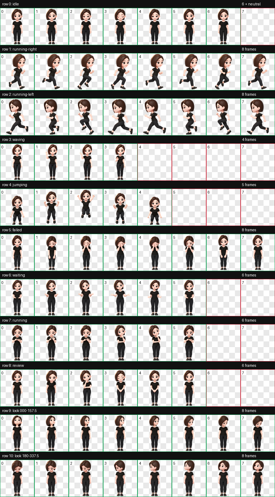

# 豆包桌宠

「豆包」是一个符合 Codex v2 规范的 3D 卡通桌面宠物：棕色短发、黑色衣裤，并包含 9 组状态动画与 16 个视线方向。



## 安装

在 Codex 的自定义宠物目录中新建 `doubao` 文件夹，再将下列两个文件复制进去：

```text
pet.json
spritesheet.webp
```

目录结构如下：

```text
<Codex 数据目录>/pets/doubao/
  pet.json
  spritesheet.webp
```

重启或刷新 Codex 后，在自定义宠物列表中选择「豆包」。

## 预览与验证

- `contact-sheet.png`：9 组动作总览
- `look-directions.png`：16 个视线方向
- `waving.gif`、`jumping.gif`：动画预览
- `atlas-validation.json`：精灵图规格验证
- `chroma-despill.json`：透明边缘处理报告
- `direction-blind-validation.json`：独立方向盲测结果
- `direction-semantics.json`：方向语义审阅结果
- `validation-summary.json`：完整验证摘要

已验证的规格：`spriteVersionNumber: 2`、`1536 × 2288` 精灵图、透明像素残留为 0，以及 16 个方向的盲测与视觉审阅通过。

## 使用权

本仓库中的角色与素材保留所有权利；未经权利人许可，请勿将素材用于再发布、训练、商业分发或衍生创作。
